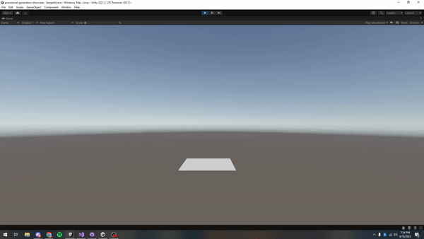

# Procedural Generation Showcase

#### This project uses procedural generation and recursive algorithms to create trees and other objects
#### Made in Unity/C#

### Classic Procedural Tree
#### A classic procedural tree generated with recursive algorithms.

### Procedural Tree with Gradient Coloring
#### A procedurally generated tree with a smooth bottom-to-top color transition, creating a visual gradient effect.

### Procedural Tree with Randomized Colors
#### A procedurally generated tree where each branch is assigned a randomized color

### Deeply Recursive Large Tree
#### A scaled-up recursive tree with deeper iterations, producing a more complex branching structures.

